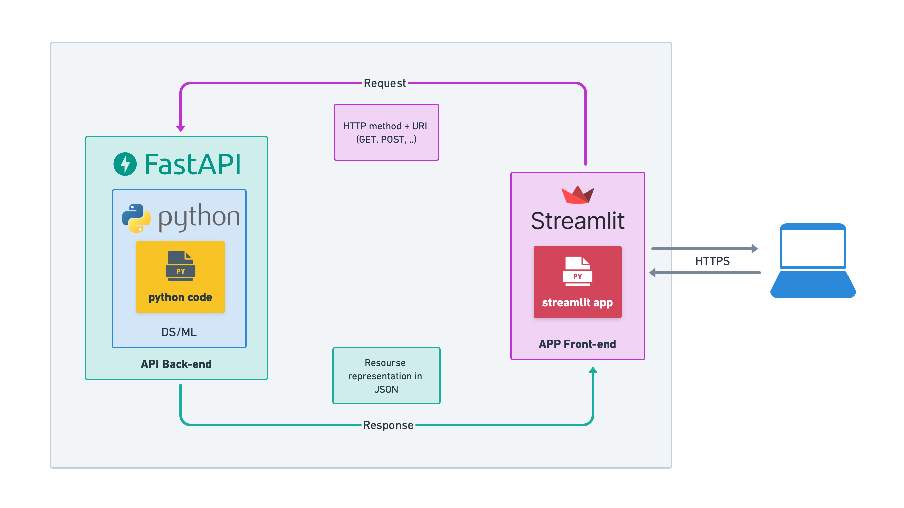
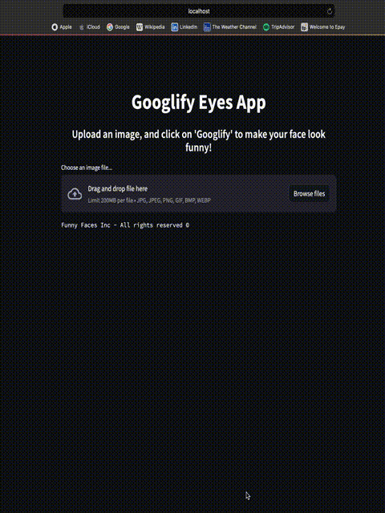

[](https://github.com/shubhamwagh/googly-eyes/actions/workflows/googly-eyes-ci-tests.yml)

<h1 align="center">
  <br>
  Googly Eyes
  <br>
</h1>

<h4 align="center">Make faces look funnier!</h4>

<p align="center">
  <a href="#description">Description</a> •
  <a href="#getting-started">Getting Started</a> •
  <a href="#system-details">System Details</a> •
  <a href="#results">Results</a> •
  <a href="#make-it-more-fun">Make It More Fun</a> •
  <a href="#references">References</a> 
</p>

<p align="center">
  
</p>

## Description

Googly Eyes is a fun project that adds a touch of humour to faces by making them look funnier with
googly eyes.

## Getting Started

### Run via Docker

* Install [docker](https://docs.docker.com/get-docker/)
* Navigate to the project directory: `cd googly-eyes`
* Run application:

```commandline
docker-compose up --build
```

* And go to http://localhost:8501

### Run via Setting Up Dev Environment

* Install [poetry](https://python-poetry.org/docs/#installation)
* Navigate to the project directory: `cd googly-eyes`
* Install necessary dependencies:

```commandline
poetry config virtualenvs.in-project true                  
poetry install 
```

* Run the backend server

```commandline
poetry run uvicorn googly_eyes.backend.server:app --reload   
```

* On new terminal, run the frontend viewer:

```commandline
cd googly-eyes/googly_eyes/frontend
poetry run streamlit run view.py
```

* And go to http://localhost:8501

#### [FastAPI](https://fastapi.tiangolo.com) docs

Go to http://localhost:8000/docs to see and try available backend api

### Run via Python Script

* Install [poetry](https://python-poetry.org/docs/#installation)
* Navigate to the project directory: `cd googly-eyes`
* Install necessary dependencies:

```commandline
poetry config virtualenvs.in-project true                  
poetry install 
```

* Run [example](./example.py) python script:

```commandline
poetry run python example.py <path-to-image-file>
```

## System Details

### High-Level Architecture



<!--Image credits - https://mafda.medium.com/prototyping-a-ml-app-with-streamlit-fastapi-hugging-face-f21f14e7d239 -->

### Backend

The backend system handles the **googlification** of eyes with the following steps:

* Detects faces using [BlazeFace](./googly_eyes/backend/lib/BlazeFace).
* Extracts facial landmarks using [FaceMesh](./googly_eyes/backend/lib/FaceMesh) for all detected faces.
* [Googlify eyes](./googly_eyes/backend/lib/GooglyEyes)
    * Extracts eyes - eye centers and eye sizes; this is randomized to make it fun.
    * Adds a googly eyes image filter based on the extracted eye centers and sizes, with random rotation for added
      humor.

### Frontend

The frontend is a [Streamlit](https://streamlit.io) viewer providing an interactive interface for users to enjoy the
googly eyes effect on
faces.

## Results



## Make It More Fun

There's a config file available! Check out [config.yaml](./config/config.yml) and feel free to experiment with the
variables. These variables have specific roles:

* Variables under `face_detection_settings`:
    * `score_threshold` - face detection confidence score between 0 and 1. A higher value may result in more accurate
      but fewer detections.
    * `iou_threshold` - intersection over union threshold for face detection to balance precision and recall, value
      between 0 and 1.
* Variables under `googly_eye_settings`:
    * `path` - image path to googly eye image filter
    * `size_multiplier`- value to scale to get bigger googly eyes
    * `size_inc_percent` - to control the maximum random increase in each googly eye's size
    * `centre_offset_percent` - to change the offset of the googly eyes' centres, makes the googly eyes placement more
      dynamic.

## References

1. [BlazeFace Paper](https://arxiv.org/pdf/1907.05047.pdf)
2. [FaceMesh Paper](https://arxiv.org/pdf/1907.06724.pdf)
3. [MediaPipe](https://github.com/google/mediapipe)

---

author: [Shubham M Wagh](mailto:shubhamwagh48@gmail.com)
